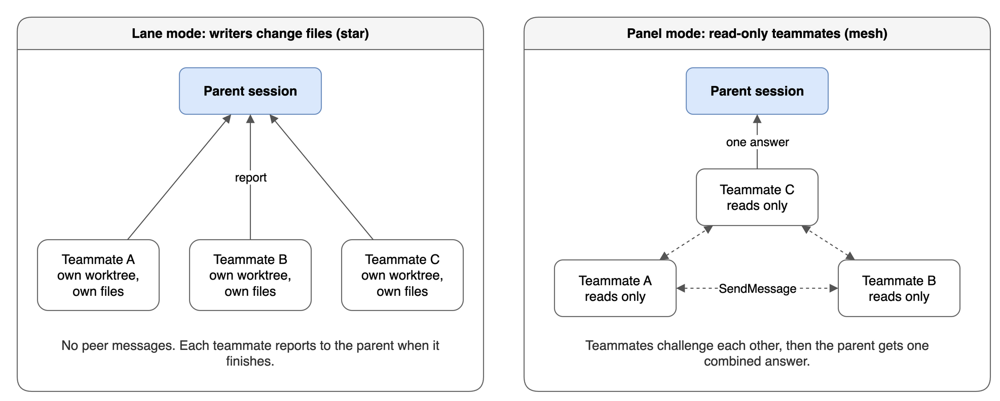

# Expert Agents

18 personas: short briefs with repo-specific guardrails, red flags, and a fixed output format. The main session spawns one as a subagent when a task touches its domain, and never reads the persona file itself. [Decisions](decisions.md#agents) records why.

## Engineering

| Agent | File | Focus |
| --- | --- | --- |
| Staff Engineer | [`staff-engineer.md`](../agents/staff-engineer.md) | Module boundaries, dependency direction, domain modeling, cross-module refactors |
| Frontend Staff Engineer | [`frontend-staff-engineer.md`](../agents/frontend-staff-engineer.md) | React and TypeScript components, client state, rendering, bundle size, web performance |
| Backend Staff Engineer | [`backend-staff-engineer.md`](../agents/backend-staff-engineer.md) | Node.js APIs, caching, rate limiting, event-driven flows, failure modes |
| DevOps Engineer | [`devops-engineer.md`](../agents/devops-engineer.md) | Terraform, Dockerfiles, GitHub Actions, Kubernetes, deploy and rollback |
| QA Expert | [`qa-expert.md`](../agents/qa-expert.md) | Test strategy, tests from unit to E2E, flaky suites; owns locked tests in `/build` |

## Infrastructure and data

| Agent | File | Focus |
| --- | --- | --- |
| AWS Expert | [`aws-expert.md`](../agents/aws-expert.md) | AWS architecture, IAM, networking, cost, Well-Architected reviews |
| GCP Expert | [`gcp-expert.md`](../agents/gcp-expert.md) | Google Cloud architecture, IAM, networking, cost, `gcloud` |
| PostgreSQL Expert | [`postgresql-expert.md`](../agents/postgresql-expert.md) | Schemas, queries, indexes, migrations, lock contention, `EXPLAIN` plans |
| Networking Expert | [`networking-expert.md`](../agents/networking-expert.md) | DNS, TLS, load balancers, CDN caching, CORS, timeouts |
| ArgoCD Expert | [`argocd-expert.md`](../agents/argocd-expert.md) | ArgoCD applications, sync policies, GitOps layout, Argo Rollouts |

## Marketing and analytics

| Agent | File | Focus |
| --- | --- | --- |
| GTM Expert | [`gtm-expert.md`](../agents/gtm-expert.md) | Tag Manager, server-side tagging, Consent Mode v2, GA4, conversion APIs |

## Security and compliance

| Agent | File | Focus |
| --- | --- | --- |
| Cybersecurity Expert | [`cybersecurity-expert.md`](../agents/cybersecurity-expert.md) | Threat models across trust boundaries, auth flows, secrets, injection |
| GDPR Expert | [`gdpr-expert.md`](../agents/gdpr-expert.md) | Lawful basis, DPIA triggers, PII flows, consent, retention, data subject rights |

## Product and design

| Agent | File | Focus |
| --- | --- | --- |
| Product Manager | [`product-manager.md`](../agents/product-manager.md) | Problem framing, scope, user stories, measurable success criteria |
| UX Expert | [`ux-expert.md`](../agents/ux-expert.md) | Usability, accessibility, WCAG, interaction flows |

## Code review

| Agent | File | Focus |
| --- | --- | --- |
| PR Reviewer | [`pr-reviewer.md`](../agents/pr-reviewer.md) | Correctness, security, and maintainability findings with file and line |
| Spec Verifier | [`spec-verifier.md`](../agents/spec-verifier.md) | Runs each acceptance criterion's check at HEAD and writes the evidence ledger |

## Documentation

| Agent | File | Focus |
| --- | --- | --- |
| Doc Reader | [`doc-reader.md`](../agents/doc-reader.md) | Answers questions from one document's text alone, for the reader test in `/document review` |

## Agent structure

Personas share a five-section skeleton, [decided](decisions.md#lean-personas-that-inherit-the-rules) to keep them short:

1. **Role**: two or three sentences of responsibility and approach.
2. **How to work**: investigate first, and return findings in the final message instead of report files. The Spec Verifier's evidence ledger is the one file a persona writes on purpose.
3. **Guardrails**: repo-specific, non-obvious blockers, each tagged `(persona)`. Rules already in `rules/` stay out, because subagents inherit `AGENTS.md` and the always-loaded rules.
4. **Red Flags**: concrete, easy-to-miss patterns that trigger investigation. The Spec Verifier has a Ledger format section instead.
5. **Output format**: the shape of the returned summary. Advisory personas return severity buckets and a verdict, and writer personas return what changed, what was verified, and concerns. The Spec Verifier returns a MEETS SPEC, GAPS, or NO SPEC verdict, one line per criterion, and the manual steps left for you.

## Advisory and writer personas

| Kind | Personas | Tools | Can join |
| --- | --- | --- | --- |
| Advisory | PR Reviewer, Spec Verifier, Cybersecurity Expert, GDPR Expert, Product Manager, UX Expert | A `tools:` list without Edit, Write, or NotebookEdit | Panel mode only |
| Writer | The other 11 | No `tools:` list, so every tool | Lane mode or panel mode |
| Doc Reader | Doc Reader | Read only, which its brief leaves unused | Neither; `/document review` spawns it directly |

Advisory personas keep Bash, which they need for `git diff` and `gh`. A write is therefore still possible through a shell command. The missing edit tools remove the easy path, and the brief does the rest.

Doc Reader reads untrusted document text, so it gets no shell and no web access. That keeps a hostile document from steering it into actions.

## Lane mode and panel mode

*Source: [`lane-and-panel.drawio`](diagrams/lane-and-panel.drawio)*

The diagram contrasts the two ways a parent session runs teammates in parallel:

- **Lane mode** is a star. Writer teammates each own disjoint files in their own git worktree, and each reports only to the parent. `/build` and `/drive-fleet` use it.
- **Panel mode** is a mesh. Read-only teammates message each other through `SendMessage` to challenge findings, then the parent gets one combined answer. `/research`, `/grill-with-docs`, and design reviews use it.

Worktrees follow from the shape: lanes change files, so they need isolation, and panels only read.

## Routing

The table in [`rules/agent-routing.md`](../rules/agent-routing.md) maps a domain trigger to each persona's `subagent_type`. It routes 17 personas; Doc Reader has no row. A task that crosses domains spawns its personas in parallel, in one message. A new API endpoint, for example, spawns the Backend Staff Engineer, the Cybersecurity Expert, and the QA Expert.

## Parallelism limits

`rules/parallel-agents.md` sets a target of 4 teammates at once and a ceiling of 5. More slices run in rounds. The reasons:

- **Merge conflict surface** scales as n*(n-1)/2: 4 agents = 6 pair combinations, 5 = 10, 8 = 28. The jump from 4 to 5 is acceptable; past 5 it gets painful fast.
- **Review bandwidth**: reviewing 4 separate diffs in one sitting is the upper edge of what a human can do without rubber-stamping.
- **API rate limits**: parent + 4 children = 5 concurrent token streams, which leaves headroom on standard tiers. 8+ regularly hits throttling and silently serializes the "parallel" work.
- **Local resources**: each worktree is a full repo copy plus tool processes. 4 is comfortable on a typical Mac; 8+ starts to matter for large monorepos.
- **Diminishing wall-clock returns**: the slowest agent dictates total time. With 4 agents you already capture ~80% of the theoretical speedup; more mostly buys coordination overhead.
