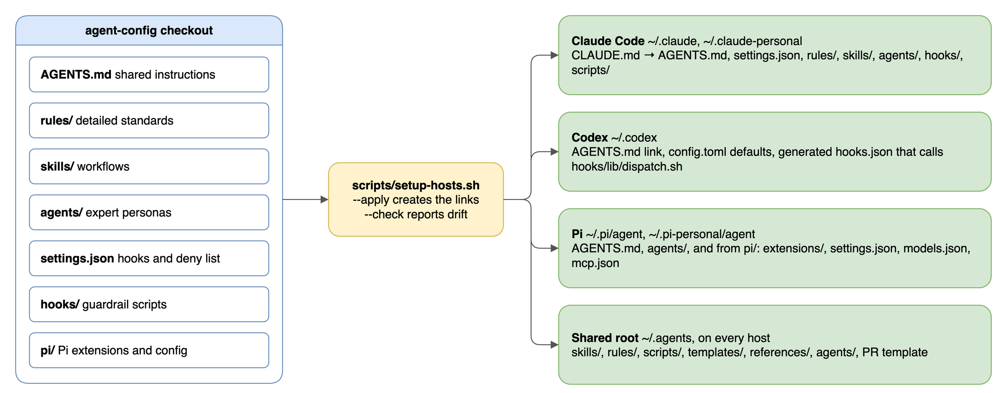

# How it works

One checkout holds the instructions, standards, workflows, personas, and guardrails for three coding agents. The agents are Claude Code, Codex, and Pi. `scripts/setup-hosts.sh` symlinks it into each agent's config dir, so an edit here reaches every host at once. Guidance lives in text the model reads. Hard limits live in hooks and a deny list that run outside the model.

## The problem it solves

Coding agents write code well and judge "done" badly, as the [README](../README.md#why) describes. Instructions help, but a long prompt competes for attention, and the agent forgets part of it as the session grows.

The repo answers with three design choices:

| Choice | How it works | Where |
| --- | --- | --- |
| Keep always-loaded text small | A word budget caps `AGENTS.md` plus the rules every session loads | `scripts/config-budget.sh` |
| Load detail only when a task needs it | Path-scoped rules, skills picked by their description, personas spawned per task | `rules/`, `skills/`, `agents/` |
| Enforce hard limits outside the model | Hooks run on tool calls, and a deny list blocks commands and paths | `settings.json`, `hooks/` |

[Decisions](decisions.md) records why each piece works the way it does.

## The pieces

| Path | Holds | How a session reaches it |
| --- | --- | --- |
| `AGENTS.md` | Shared instructions: priorities, writing, workflow, safety, git | Loaded at session start on every host |
| `rules/` | 15 detailed standards, such as git, tests, and comments | See [rules](rules.md) |
| `skills/` | 38 workflows, such as `/build`, `/mr`, and `/debug` | Picked by description, or typed as `/name`. See [skills](skills.md) |
| `agents/` | 18 expert personas | Spawned as subagents. See [agents](agents.md) |
| `settings.json` | Hook registry, deny list, and Claude Code settings | Read by each host. See [hooks](hooks.md) |
| `hooks/` | Guardrail scripts | Run on tool calls and session events |
| `pi/` | Pi extensions, settings, models, and MCP servers | Linked into each Pi agent dir |
| `scripts/` | Host setup, CI checks, status line, notifications, worktree pruning | Run by you, CI, hooks, and skills |
| `templates/`, `references/` | Doc templates; security and testing checklists | Named by skills and personas through `~/.agents/` |
| `tests/` | Tests for the hooks, host setup, and Pi extensions | Run by CI. See [contributing](contributing.md) |
| `CONTEXT.md` | Glossary of the terms these docs use | Read by people and by `/grill-with-docs` |

## How each host finds the config

*Source: [`host-wiring.drawio`](diagrams/host-wiring.drawio)*

The diagram shows the checkout on the left and the four linked locations on the right. `scripts/setup-hosts.sh --apply` creates the links, and `--check` reports any that drifted.

- **Claude Code** gets `CLAUDE.md` linked to `AGENTS.md`, because Claude Code reads `AGENTS.md` only at project level. It also gets `settings.json`, `rules/`, `skills/`, `agents/`, `hooks/`, `scripts/`, and a few more files, in `~/.claude` and `~/.claude-personal`. [Setup](setup.md) lists every link.
- **Codex** gets `AGENTS.md`, a few `config.toml` defaults, and a generated `hooks.json` that sends hook events to `hooks/lib/dispatch.sh`.
- **Pi** gets `AGENTS.md`, `agents/`, and the files in `pi/`.
- **The shared root `~/.agents/`** is set up with every host unless the machine scope skips `shared`. Codex and Pi find skills there. A shared skill names `~/.agents/...`, so one absolute path resolves everywhere.

Codex and Pi run the hooks from the checkout, through `hooks/lib/dispatch.sh`. [Hooks](hooks.md#host-coverage) shows how each host runs them.

Because the hosts hold links, not copies, an edit in the checkout is live at once. Moving the checkout breaks every host together. Run `bash scripts/setup-hosts.sh --apply --adopt` from the new location to relink them, including the Codex `hooks.json`. [Setup](setup.md) lists every link and the variables that change the defaults.

A session start checks for drift. Claude Code runs `hooks/symlink-check.sh`, and Pi runs the `drift-check` extension. Claude Code prints the exact fix command, and Pi points to `setup-hosts.sh --apply`. Codex shows no drift warning, so run `--check` there by hand.

## What a session loads

Most of the config costs nothing until a task needs it.

| When | What enters the session | Host |
| --- | --- | --- |
| Session start | `AGENTS.md` and the 9 rules without `paths:` frontmatter | Claude Code |
| Session start | `AGENTS.md` only | Codex, Pi |
| A touched file matches a rule's `paths:` glob | That rule, such as `rules/typescript.md` for a `.ts` file | Claude Code |
| A task needs a standard | The `rulebook` skill loads the matching `rules/` file | Codex, Pi |
| A request matches a skill's description | That skill's `SKILL.md` | All |
| A task touches a specialized domain | A persona, in a subagent with its own context | All |
| A tool call matches a registry entry | Hooks run; they add text only when they block or report | Claude Code, Codex |
| A `bash`, `edit`, or `write` call | Hooks run through the `hook-bridge` extension | Pi |

The main session never reads a persona file. Persona text in the main thread costs thousands of tokens and biases later, unrelated work.

## Enforcement layers

A rule the model must remember is weaker than a check the model cannot skip. Every rule bullet in `rules/`, persona guardrails, and skill rules ends with a tag naming what enforces it: `(hook)`, `(lint)`, `(CI)`, `(persona)`, or `(review-time: <why>)`. The tag tells a reader how much to trust a rule. A `(review-time)` tag must say why no hook can check it, so each one marks a candidate for a stronger check. [Rules](rules.md#enforcement-tags) explains each tag and its cost of a miss.

The deny list in `settings.json` sits beside the hooks. It blocks reads and edits of secrets and credential stores, and commands such as `rm -rf`, `sudo`, force-pushes, pushes to `main`, and `gh pr merge`. It matches literal patterns, so it adds friction rather than a sandbox. [Hooks](hooks.md) lists every hook and deny rule group.

## Context budget

Every always-loaded word competes for attention in every session. `scripts/config-budget.sh` caps the words and `(review-time)` tags in `AGENTS.md` plus the always-loaded rules, and CI fails above the cap. A new rule that fits a file pattern gets `paths:` frontmatter, and a new procedure goes into a skill. Raising the cap is a deliberate edit to the script, reviewed in the same pull request as the rule that needs it. [Rules](rules.md#the-budget) gives the limits.

## Workflow state

Skills and hooks share state through files under `.claude/state/` in the project being worked on. Every host reads and writes the same paths, so work moves between sessions and hosts without conversion. This repo gitignores it, because here the files are personal notes.

| Path | Written by | Read by |
| --- | --- | --- |
| `research/` | `/research`, `/debug`, `/fix-issue` | Later sessions |
| `specs/` | `/spec` | `/plan`, Spec Verifier, `pre-pr-evidence-gate.sh` |
| `plans/` | `/plan`, `/grill-with-docs`, `/fix-issue`, `/drive-fleet` | `/build`, `/worktree` |
| `sessions/` | `/summarize` | People |
| `runs/<branch>/tasks.md` | `/deliver`, `/build` | The same skills, when resuming after compaction |
| `runs/<branch>/tests.lock` | QA Expert | `pre-edit-test-lock.sh` |
| `runs/<branch>/evidence.md`, the evidence ledger | Spec Verifier | `pre-pr-evidence-gate.sh`, before a PR opens |
| `runs/<branch>/reply-drafts.md` | `/pr-comments` | You, before posting a reply to a human |
| `wayfinder/<effort>.md` | `/wayfinder` | `/wayfinder` in later sessions |

`<branch>` is the branch name with `/` replaced by `-`. The test lock and evidence hooks look in the current worktree first, then in the main checkout.

## Where to go next

The [README docs table](../README.md#docs) lists every doc and what it covers.
