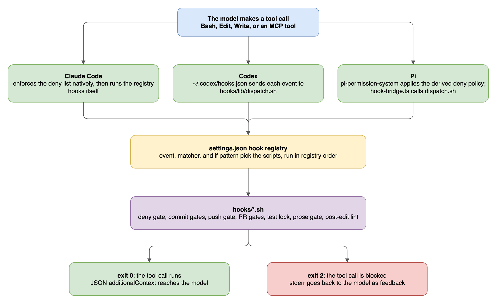

# Hooks and the deny list

`settings.json` holds one hook registry and one deny list for every host. Claude Code runs the registry itself; Codex and Pi run the same scripts through `hooks/lib/dispatch.sh`. A hook that exits 2 blocks the tool call, and its message goes back to the model.

## Why hooks

An agent can forget an instruction. It cannot skip a hook, because the host runs the hook before or after the tool call, outside the model. A rule that a script can check therefore lives in `hooks/` and carries the `(hook)` tag, as [rules](rules.md#enforcement-tags) describes.

## How a hook runs

*Source: [`hook-dispatch.drawio`](diagrams/hook-dispatch.drawio)*

The diagram follows one tool call. Each host passes it to the same registry, the registry picks the matching scripts, and each script's exit code decides the outcome.

A registry entry has four parts:

| Part | Meaning | Example |
| --- | --- | --- |
| Event | When the hook runs | `PreToolUse`, `PostToolUse`, `SessionStart` |
| `matcher` | A regex on the tool name, or on the session source | `Bash`, `Write\|Edit` |
| `if` | An optional glob on the tool input | `Bash(git commit *)` |
| `command` | The script and its arguments, with a timeout | `hooks/prose-gate.sh commit` |

Each command runs the current project's `hooks/<name>` when that file is executable, and `~/.claude/hooks/<name>` otherwise. A session inside this repo therefore runs the checkout's own copy, so a hook edit takes effect in that session.

Exit codes decide the outcome:

- **0** lets the tool call run. JSON output with `additionalContext` adds text for the model.
- **2** blocks a `PreToolUse` call, and the script's stderr reaches the model as feedback. A `PostToolUse` hook runs after the file is saved, so its exit 2 sends the feedback without undoing the edit.
- Any other code lets the call run. Claude Code shows a non-blocking error, and `dispatch.sh` ignores the code, so a broken hook fails open on every host.
- `dispatch.sh` kills a hook that runs past its `timeout`, 60 seconds when unset, and lets the call run.

## Host coverage

| Host | Tool hooks | Session hooks | Deny list |
| --- | --- | --- | --- |
| Claude Code | Native, from `settings.json` | Native: `SessionStart`, `SessionEnd`, `Notification` | Native `permissions.deny`, plus `deny-gate.sh` |
| Codex | `~/.codex/hooks.json` calls `dispatch.sh` | `SessionStart` and `SessionEnd` through `dispatch.sh`; no `Notification` | `deny-gate.sh`, including the `Bash` rules |
| Pi | The `hook-bridge` extension calls `dispatch.sh` for `bash`, `edit`, and `write` | Extensions instead: `drift-check` at start, `worktree-cleanup` at shutdown | The `permission-gate` extension derives a policy for the pinned `pi-permission-system` package; `deny-gate.sh` runs through the bridge |

`dispatch.sh` makes one registry serve three hosts. It reads `settings.json` from the checkout on every call, so a registry edit reaches Codex and Pi at once. It maps each host's tool names to Claude Code's, so Codex shell tools become `Bash` and each file in an `apply_patch` becomes an `Edit`. It runs the matching hooks in registry order, stops at the first exit 2, and merges the context the others print.

## PreToolUse hooks

These run before the tool call and can block it. The rows follow registry order, which is the order the hooks run.

| Hook | Runs on | Blocks when | Bypass |
| --- | --- | --- | --- |
| `deny-gate.sh` | Bash, Write, Edit, MCP tools | A command names a denied path, an edit targets one, or an MCP tool is denied. `Bash` rules apply on Codex only | None |
| `pre-git-state-refresh.sh` | `git push`, `git commit`, and `gh pr` `edit`, `comment`, `merge`, `close`, `ready`, `review`; not `gh pr create` | Never. It adds a `[pr-state]` line with the branch's PR state | `SKIP_PR_STATE_REFRESH` |
| `pre-pr-test-gate.sh` | `gh pr create`, `gh pr ready` | The title is not conventional, or HEAD has no passing verify run | `SKIP_PR_TEST_GATE` |
| `pre-pr-evidence-gate.sh` | `gh pr create`, when a spec names the branch | A non-manual acceptance criterion lacks a PASS row at HEAD | `SKIP_EVIDENCE_GATE` |
| `pre-push-gate.sh` | `git push`, including `git -C <dir> push` | A repo check fails, `node_modules` is missing, or `core.hooksPath` names a missing dir. See below | `SKIP_PUSH_GATE` |
| `pre-commit-branch-gate.sh` | `git commit`, including `git -C <dir> commit` | The branch is `main` or `master` | `SKIP_COMMIT_BRANCH_GATE` |
| `pre-commit-coauthor-gate.sh` | `git commit` | The command contains a `Co-authored-by` trailer | `SKIP_COAUTHOR_GATE` |
| `pre-commit-conventional-gate.sh` | `git commit` | The subject is not a conventional commit | `SKIP_CONVENTIONAL_GATE` |
| `prose-gate.sh` | `git commit`, `gh pr create`, `gh pr edit` | The message or body uses a blocked word, curly quotes, or an emoji heading | `SKIP_PROSE_GATE` |
| `pre-pr-body-gate.sh` | `gh pr` and `gh issue` create or edit | The title or body has AI attribution or a `.claude/state/` path | `SKIP_PR_BODY_GATE` |
| `pre-pr-reply-gate.sh` | `gh api`, `gh pr comment`, `gh pr review`, `gh issue comment` | The call replies inline to a human's comment, or a comment lacks the agent footer | `SKIP_REPLY_FOOTER`, footer check only |
| `pre-edit-test-lock.sh` | Write, Edit | Anyone but the QA Expert edits a test listed in `tests.lock` | None |

The conventional and co-author gates read the message from the command. A message passed with `-F` or written in an editor skips them.

Two gates defer to the repo they run in:

- `pre-push-gate.sh` steps aside when the repo has its own executable pre-push hook, and runs `verify:fast` when `package.json` declares it. Otherwise it runs each of `lint`, `typecheck`, `knip`, `test`, and `build` that `package.json` declares, then a critical-only audit. In a Terraform dir it runs `terraform fmt -check` and `terraform validate`. A dir with neither `package.json` nor `.tf` files passes.
- `pre-pr-test-gate.sh` reads the `verify-passed` stamp that the repo's `npm run verify` writes to the git dir. It runs `npm test` only in repos without `verify`.

## PostToolUse hooks

These run after a Write or Edit. A block here reports the problem after the file is saved.

| Hook | Does | Blocks when | Bypass |
| --- | --- | --- | --- |
| `auto-format.sh` | Runs Prettier when the repo configures it and has no Biome config | Never | None |
| `post-edit-typecheck.sh` | Runs `biome check --write` on the file when the repo has Biome | Biome reports an error | `SKIP_POST_EDIT_TYPECHECK` |
| `post-edit-lint.sh` | Replaces em dashes, then checks the added lines | Tracker refs in comments, stacked `//` or `--` comments, `var`, TODO markers, `SELECT *`, `:latest` | `SKIP_POST_EDIT_LINT` |
| `prose-gate.sh file` | Checks the added lines of a Markdown file | A blocked word, curly quotes, or an emoji heading | `SKIP_PROSE_GATE` |

The prose gate also prints advisories that never block: words to reconsider, sentences over 25 words, and a causal "since".

## Session hooks

| Event | Hook | Does |
| --- | --- | --- |
| `SessionStart`, startup | `symlink-check.sh` | Warns when the Claude Code links drifted, with the fix command |
| `SessionStart`, after compaction | Inline `echo` | Reminds the model of the workflow, `/verify-done` before a PR, and the current year |
| `SessionStart` | `herdr-agent-state.sh` | Reports the session to herdr when `HERDR_ENV=1` |
| `SessionEnd` | `worktree-cleanup.sh` | Runs `scripts/worktree-prune.sh --apply`; `CLAUDE_DISABLE_WORKTREE_CLEANUP=1` turns it off |
| `Notification` | Inline `osascript` | Shows a macOS notification on a permission or idle prompt |

## Bypass variables

Each `SKIP_*` variable takes the value `1` and is read from the environment of the hook process. Hooks inherit the host's environment, not the tool command's, so set the variable when you start the host, as in `SKIP_PROSE_GATE=1 claude`. `SKIP_PUSH_GATE=1` also works as a prefix on the `git push` command.

A bypass is a deliberate human override, not a tool for the agent. A pull request that relies on one says so in its description.

## The deny list

`permissions.deny` in `settings.json` holds 110 rules:

| Kind | Count | Examples |
| --- | --- | --- |
| `Read(...)` | 47 | `Read(**/.env)`, `Read(~/.ssh/**)`, `Read(**/*.pem)` |
| `Edit(...)` | 44 | `Edit(**/.env.production)`, `Edit(~/.aws/**)` |
| `Bash(...)` | 18 | `Bash(rm -rf *)`, `Bash(git push --force *)`, `Bash(git push * main)`, `Bash(gh pr merge *)` |
| MCP | 1 | `mcp__claude_ai_Atlassian__*` |

- Deny wins over allow on every host.
- An `Edit` rule also blocks writes: natively on Pi, and through `deny-gate.sh` on every host.
- `deny-gate.sh` also blocks a shell command that names a denied path, so `cat .env` fails like a `Read` of `.env` on every host.
- The rules match literal patterns. `rm -fr` and `git push --force-with-lease` do not match, so the deny list adds friction, not a sandbox.
- `deny-gate.sh` needs Node.js 22.18 or later, and allows everything when `node` is missing.

## Where each hook is tested

| Test | Covers |
| --- | --- |
| `tests/deny-gate.test.ts` | `hooks/lib/deny-gate.ts` and its wrapper |
| `tests/dispatch.sh` | `hooks/lib/dispatch.sh`: matching, tool aliases, exit codes, timeouts |
| `tests/hook-bridge.test.ts`, `tests/permission-gate.test.ts` | The Pi bridge, and the policy derived from the real deny list |
| `tests/commit-gates.sh` | The conventional-commit gate and the prose gate on commits |
| `tests/pr-gates.sh`, `tests/pre-pr-test-gate.sh`, `tests/pr-reply-gate.sh` | The PR body, prose, test, and reply gates |
| `tests/evidence-gate.sh`, `tests/test-lock.sh` | The evidence gate and the test lock |
| `tests/pre-push-gate.sh`, `tests/resolve-repo.sh` | The push gate, and how hooks find the target repo |
| `tests/post-edit-hooks.sh` | The three per-edit hooks |
| `tests/symlink-check.sh` | The drift check |
| `hooks/prose-gate.test.sh` | Prose gate fixtures, plus every tracked Markdown file |

`pre-commit-coauthor-gate.sh`, `herdr-agent-state.sh`, and `worktree-cleanup.sh` have no test. [Contributing](contributing.md#add-a-hook) shows how to add a hook with its test.
