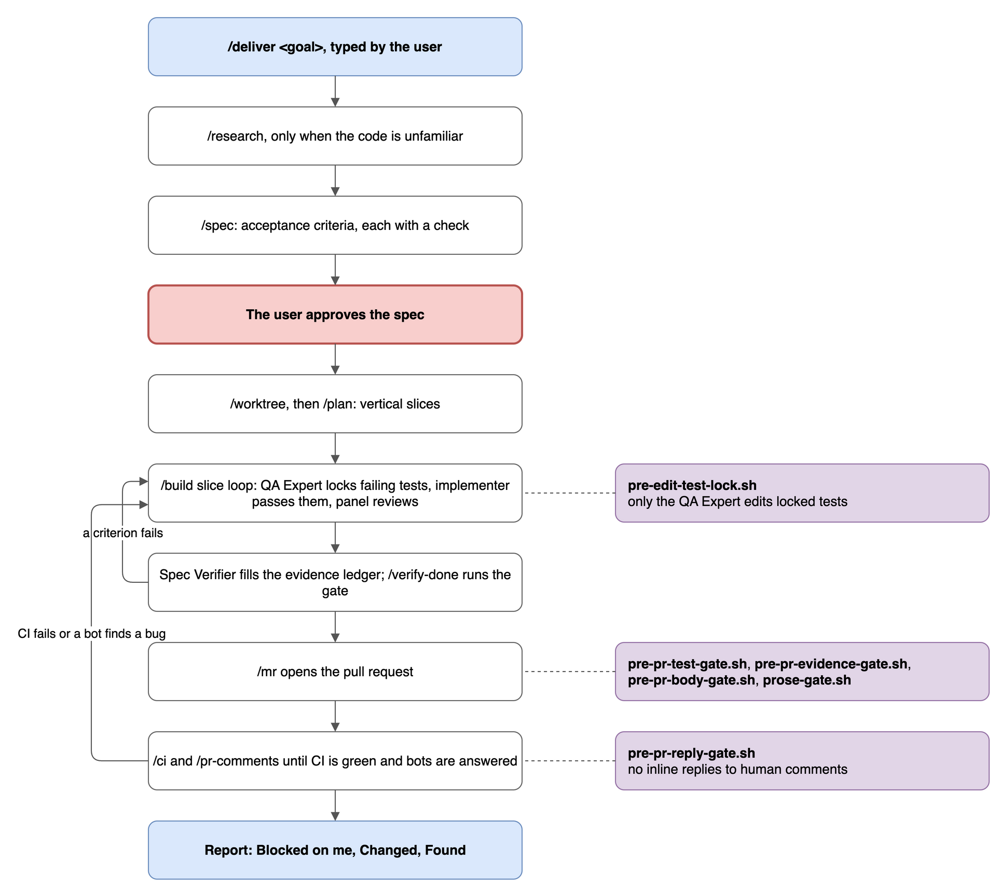

# Skills

A skill is a `skills/<name>/SKILL.md` file whose `description` says when to use it. The model loads a skill when a request matches that description, and three skills start only when you type them. This doc explains how skills load and what each one does. To find the skill for a task, use the [cheatsheet](../CHEATSHEET.md).

## How skills load

- Every host reads `skills/` through `~/.agents/skills`. Claude Code also reads it through `~/.claude/skills`, and `package.json` declares it for Pi.
- A **model-invoked** skill carries trigger phrases in its description, so the model enters it without being asked. 35 skills work this way.
- A **user-invoked** skill sets `disable-model-invocation: true`, so only a typed `/name` starts it. `deliver`, `wayfinder`, and `wait-what` work this way. The first two start long runs, which should start only when you ask. `wait-what` says the last reply did not land, which only you can judge.
- Shared skills use Claude Code notation: `/name`, `$ARGUMENTS`, `Agent`, and `SendMessage`. `AGENTS.md` maps each one to the equivalent on Codex and Pi.
- A skill adapted from an upstream repo names its source, usually in a `> Source:` line. The copies drift from upstream on purpose, and re-syncing is manual.

## Orchestrators and disciplines

An **orchestrator** runs other skills or personas in sequence: `build`, `deliver`, `drive-fleet`, `fix-issue`, `grill-with-docs`, and `wayfinder`. Every other skill is a **reusable discipline** that holds one practice, such as `test` or `debug`. An orchestrator calls disciplines, so a practice lives in one file. [CONTEXT.md](../CONTEXT.md#skill-model) defines both terms.

## Catalog

Rows marked **user** start only when you type them.

### Understand and plan

| Skill | Starts | Does |
| --- | --- | --- |
| `research` | model | Reads the code for a topic and saves a research artifact, proposing no solution |
| `grill-with-docs` | model | Questions a plan one decision at a time and updates the `CONTEXT.md` glossary |
| `spec` | model | Writes requirements with acceptance criteria, each with a `test`, `cmd`, or `manual` check |
| `plan` | model | Turns an approved spec into vertical slices, each with its tests and verify command |
| `to-issues` | model | Breaks a plan or spec into tracker issues |
| `wayfinder` | **user** | Maps an effort too big for one session as decision tickets in a file |
| `prototype` | model | Builds a throwaway prototype to settle one design question |
| `improve-codebase-architecture` | model | Finds modules to deepen, informed by the glossary and past decisions |

### Build

| Skill | Starts | Does |
| --- | --- | --- |
| `build` | model | Implements an approved plan with quality gates and a tests-first slice loop |
| `deliver` | **user** | Runs a feature from spec to a merge-ready PR with one human gate |
| `drive-fleet` | model | Drives several PRs to done under `/goal`, with worktree subagents doing the edits |
| `fix-issue` | model | Investigates and fixes a GitHub issue, from research to PR |
| `test` | model | Writes tests first, or proves a bug with a failing test |
| `constraints` | model | Writes `CONSTRAINTS.md`: a quality bar with a command behind each number |
| `observability` | model | Adds logs, metrics, traces, and alerts before a feature ships |
| `wizard` | model | Generates a bash wizard for steps only a human can do |

### Verify and ship

| Skill | Starts | Does |
| --- | --- | --- |
| `verify-done` | model | Runs the repo's `npm run verify`, or the checks CI runs, then reviews the diff |
| `mr` | model | Opens a PR or MR after the gate, commit format, and title checks pass |
| `ci` | model | Watches the branch's pipeline and reacts to pass, fail, and manual states |
| `pr-comments` | model | Fixes code for review comments, replies to bots, and drafts replies to humans |
| `review-pr` | model | Reviews a PR with severity-tagged findings |
| `prune` | model | Reviews code only for over-engineering and lists what to delete |
| `resolve-conflicts` | model | Resolves a merge or rebase conflict by recovering each side's intent |
| `ship` | model | Runs the pre-launch checklist and release steps |

### Investigate

| Skill | Starts | Does |
| --- | --- | --- |
| `debug` | model | Ranks hypotheses from evidence before any code change |
| `sentry-issue` | model | Fetches and digests a Sentry issue by ID or URL |
| `jira` | model | Reads and writes Jira items through the `acli` CLI |

### Docs and writing

| Skill | Starts | Does |
| --- | --- | --- |
| `document` | model | Checks, audits, reviews, and writes a repo's docs |
| `diagram` | model | Writes a drawio diagram, falling back to mermaid when drawio is unavailable |
| `write-plain` | model | Edits prose to remove patterns that read as machine-written |
| `write-a-skill` | model | Gives the principles for writing or editing a skill |

### Sessions and worktrees

| Skill | Starts | Does |
| --- | --- | --- |
| `summarize` | model | Writes a session diary, then prunes merged worktrees |
| `handoff` | model | Compacts the conversation into a doc a fresh session can pick up |
| `wait-what` | **user** | Restates the last reply in simpler terms |
| `worktree` | model | Creates a worktree for the current task and switches into it |
| `worktree-merge` | model | Removes a merged worktree and its local branch |
| `worktrees` | model | Audits or prunes worktrees in this repo or across `~/dev` |

### Standards

| Skill | Starts | Does |
| --- | --- | --- |
| `rulebook` | model | Routes any host to the `rules/` file a task needs; Codex and Pi rely on it because they do not load `rules/` natively |

## How `/deliver` runs

`/deliver <goal>` takes a feature from a goal to a merge-ready PR. You approve the spec; the run handles the rest and stops only for the gates you keep.

*Source: [`deliver-flow.drawio`](diagrams/deliver-flow.drawio)*

The diagram shows the stages top to bottom: `/research` when the code is unfamiliar, `/spec`, the user's approval in red, `/worktree` and `/plan`, the `/build` slice loop, the Spec Verifier and `/verify-done`, `/mr`, then `/ci` and `/pr-comments`, and a final report. On the right, `pre-edit-test-lock.sh` gates the slice loop, the PR gates (`pre-pr-test-gate.sh`, `pre-pr-evidence-gate.sh`, `pre-pr-body-gate.sh`, `prose-gate.sh`) gate `/mr`, and `pre-pr-reply-gate.sh` gates comment replies. The two loops on the left send a failed criterion or a red CI run back to the slice loop.

The run stops for you when:

- The spec is ready to approve.
- A reply to a human reviewer needs posting. The run drafts it in `reply-drafts.md`.
- An action is a force-push, merge, push to `main`, production change, data deletion, or change outside the repo.
- The plan needs an architectural choice the spec left open.

Anything else it cannot resolve goes under **Blocked on me** in `tasks.md`, and the run continues with the slices that do not depend on it.

## The slice loop in `/build`

The author of code never grades it. Each slice with tests runs this loop:

| Step | Who | Does |
| --- | --- | --- |
| 1 | QA Expert | Writes failing tests at the spec's seams, commits them, and lists them in `tests.lock` |
| 2 | Implementer | Makes the tests pass. `pre-edit-test-lock.sh` blocks edits to locked tests |
| 3 | Review panel | PR Reviewer, Cybersecurity Expert, and Spec Verifier, plus GDPR, UX, or PostgreSQL Expert when the diff touches their domain |
| 4 | Implementer, QA Expert | Fix code findings and test findings |
| 5 | Review panel | Re-reviews until no blocker remains, up to three rounds |

After the last slice, the Spec Verifier runs each acceptance criterion's check at HEAD and records PASS or FAIL in `evidence.md`. `pre-pr-evidence-gate.sh` blocks the PR until every automated criterion passes at HEAD.

## `/drive-fleet` and `/wayfinder`

`/drive-fleet` handles several independent PRs at once. A grill plans lanes that share no files. Then one manager session loops under Claude Code's `/goal` until every PR is green, reviewed, and rebased. Worktree subagents make every edit, and the manager never touches a working tree. It stops for a conflict that breaks the plan, the same CI failure three times, or an outward action after completion.

`/wayfinder` plans an effort too large for one session. It keeps a map in `.claude/state/wayfinder/<effort>.md` with decision tickets, and each session resolves one ticket. It plans rather than builds, and hands off to `/spec` once the open questions are gone.

## Where skills keep state

Skills write their artifacts under `.claude/state/` in the project. Per-branch run files, such as `tasks.md`, `tests.lock`, `evidence.md`, and `reply-drafts.md`, sit in `.claude/state/runs/<branch>/`. [How it works](architecture.md#workflow-state) lists each path and who reads it.
